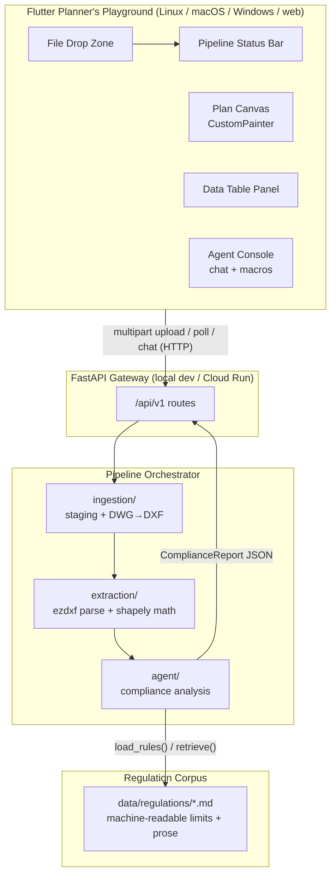
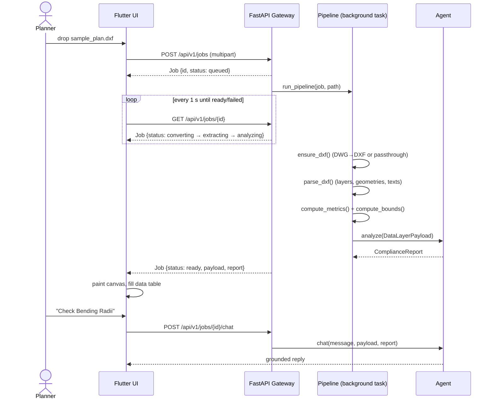
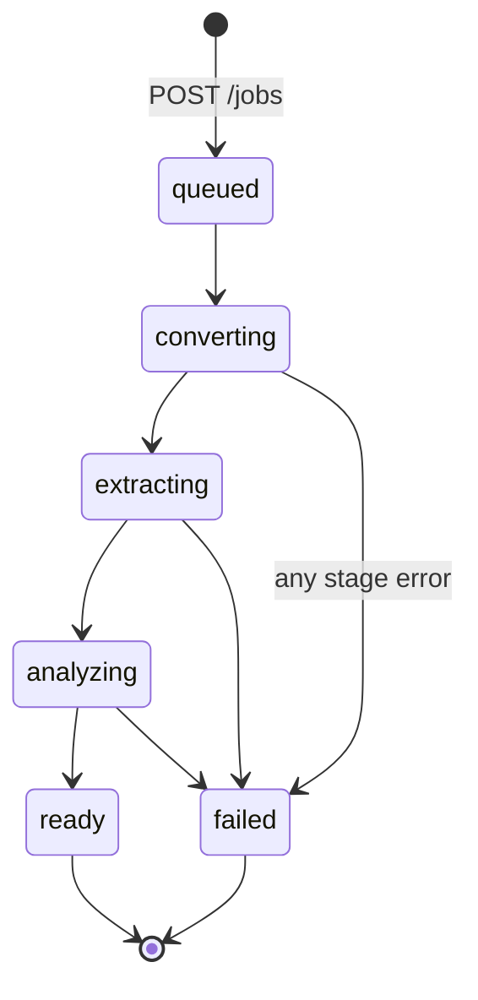

# System Architecture

## 1. Problem & Goal

Electrical planning engineers manually transcribe CAD metadata into
documentation templates for low-voltage connections to railway-owned energy
systems (e.g., DB Energie GmbH). This introduces **template drift** — citing
retired guidelines (e.g., Ril 954.0107) — and physical parameter errors that
trigger rejections during Federal Railway Authority (EBA) review.

**Rail50Hz.ai** automates the first data layer of that workflow:

1. Convert DWG → DXF (ODA File Converter)
2. Mathematically structure the geometry (`ezdxf` + `shapely`)
3. Run an AI agent that validates extracted parameters against active
   DB Ril / VDE guidelines and produces a structured compliance report

> ⚠️ Liability for final validation always remains with the human engineer.

## 2. Component Overview

### Component responsibilities

| Component | Path | Responsibility |
| :--- | :--- | :--- |
| Flutter app | `frontend/` | Three-panel planner workstation: upload, visualize, inspect, chat |
| API gateway | `backend/app/api/` | REST surface; owns job lifecycle endpoints |
| Orchestrator | `backend/app/pipeline/` | Drives convert → extract → analyze; holds the `JobStore` |
| Ingestion | `backend/app/ingestion/` | Upload staging (local disk), ODA DWG→DXF conversion |
| Extraction | `backend/app/extraction/` | DXF entity parsing, spatial metrics, annotation mining |
| Agent | `backend/app/agent/` | Compliance analysis (mock rules or Vertex AI Gemini) + mini-RAG |
| Schemas | `backend/app/models/schemas.py` | **Single source of truth** for the API contract |
| Config | `backend/app/core/config.py` | Env-driven settings (`.env` / Cloud Run env vars) |

## 3. Data Flow (happy path)

### Job state machine

Every stage failure lands in `failed` with `Job.error` set — the frontend
surfaces it in the status bar instead of hanging.

## 4. Key Design Decisions

| Decision | Rationale |
| :--- | :--- |
| **Mock-first agent** (`AGENT_MODE=mock` default) | Demo never dies on missing GCP credentials; deterministic output for tests; Vertex adapter is a drop-in behind the same `AgentClient` interface |
| **DXF passthrough** | ODA File Converter is proprietary and Linux-fiddly; only raw `.dwg` needs it, so the pipeline is fully testable without it |
| **Schema mirroring, not codegen** | `schemas.py` ↔ `frontend/lib/models/job.dart` are hand-mirrored 1:1. For a POC this beats an OpenAPI codegen toolchain; swap in `openapi-generator` when the contract stabilizes |
| **In-memory `JobStore`** | Single-process dev / single Cloud Run instance is enough for the POC; the store is one class with a lock — swap for Firestore/Redis to scale out |
| **Machine-readable limits inside regulation markdown** | One file serves both the deterministic mock validator (`load_rules()`) and LLM grounding (`retrieve()`); adding a regulation = dropping a `.md` file |
| **Frontend polls instead of WebSocket/SSE** | 1 s polling on a job endpoint is trivially robust across desktop + web + Cloud Run; streaming is an optimization, not a requirement |
| **`--dart-define=API_BASE_URL`** | Same Flutter binary targets local dev or Cloud Run without code changes |

## 5. Scaling Path (post-POC)

| Concern | POC state | Next step |
| :--- | :--- | :--- |
| Job persistence | In-memory dict | Firestore / Redis; make `JobStore` an interface |
| File storage | Local `workdir/` | GCS bucket (`ingestion/storage.py` is the seam) |
| Regulation retrieval | Keyword scoring over markdown | Vertex AI Search / embedding index (`agent/rag.py` is the seam) |
| DWG conversion | ODA CLI subprocess in-request | Dedicated converter service or Cloud Run job queue |
| Agent | Single-shot analyze + chat | Multimodal (plan renders as images), tool-use for coordinate queries |
| Auth | None (hackathon) | IAP / Firebase Auth in front of Cloud Run |
| Contract sync | Manual Dart mirror | OpenAPI codegen from FastAPI's `/openapi.json` |
