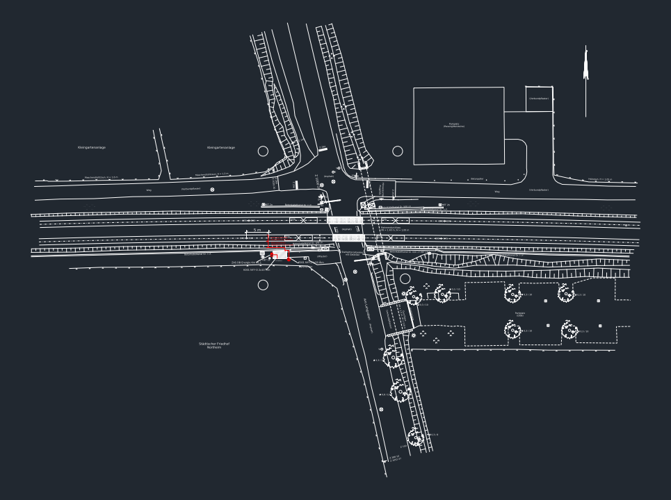

# CAD Engine Evaluation — Open CASCADE (OCCT) Feasibility

Question: should we adopt **Open CASCADE Technology**
(<https://dev.opencascade.org/about/project_overview>) as the CAD engine for
the Rail50Hz pipeline (currently: LibreDWG `dwg2dxf` → `ezdxf` → `shapely`)?

## Verdict

**Not for the current 2D DXF/DWG pipeline — keep ezdxf/shapely.**
OCCT becomes interesting only if/when the roadmap adds **3D** (STEP models of
cabinets/substations, clearance analysis, mesh export for 3D viewers).

## 1. What OCCT is (checked 2026-07-18)

- Open-source **C++ 3D B-Rep modeling kernel** (LGPL-2.1) — the geometry core
  behind FreeCAD, CadQuery/build123d, KiCad's 3D viewer.
- Strengths: solid/surface modeling, booleans, filleting, topology, meshing,
  visualization, OCAF application framework.
- **Data exchange in the open-source core: STEP and IGES only** (plus glTF/
  OBJ/BREP mesh formats). The project overview page confirms only these
  neutral formats.

## 2. Why it does not fit the DXF/DWG task

| Criterion | Our need | OCCT reality |
| :--- | :--- | :--- |
| Read `.dwg` | Required (planners upload DWG) | ❌ Not supported at all in open source; Open Cascade sells DWG/DXF translators as **commercial add-on components** |
| Read `.dxf` | Required | ❌ Same — not in the LGPL core. (FreeCAD, notably, wrote its *own* DXF importer instead of using OCCT for it) |
| Layers, text annotations, block refs | Core of our compliance signal (citations, `R=…mm`) | ❌ Out of scope for a B-Rep kernel — OCCT models geometry, not drawing semantics (layers/annotations would be lost even after a format conversion) |
| 2D lengths/areas | Required | ✅ Possible, but massive overkill vs `shapely` |
| Python integration | FastAPI backend | ⚠️ `pythonocc-core` / OCP bindings are conda-first, heavyweight (hundreds of MB), and add C++ ABI fragility to deploys |
| Effort/benefit | Hackathon POC | ❌ Weeks of integration for zero new capability on 2D drawings |

**Bottom line:** for 2D drawing intelligence, `ezdxf` *is* the specialist
tool (entities, layers, text, blocks, INSERT traversal), `shapely` covers all
spatial math, and LibreDWG solves DWG→DXF. OCCT solves a different problem
(3D solid modeling) and would still need a DXF path in front of it.

## 3. Where OCCT *would* pay off later (roadmap option)

1. **3D asset models:** import STEP models of control cabinets / equipment,
   compute volumes, collision & clearance distances (e.g., minimum distances
   to live parts per VDE) — genuinely OCCT territory.
2. **2D→3D lifting:** extrude extracted room polygons + cable routes into a
   3D scene, mesh with OCCT, export glTF for a Flutter 3D viewer.
3. **Integration path when needed:** separate `occt-service` container
   (Python + `pythonocc-core` from conda-forge, or CadQuery's `OCP` wheels),
   isolated from the main backend so its footprint doesn't bloat Cloud Run.

## 4. Alternatives considered for "more CAD power" on 2D

| Option | Use when |
| :--- | :--- |
| `ezdxf` block traversal (`INSERT`/`ATTRIB`) | **Next step** — unlocks the annotation text in real plans; pure Python, zero new deps |
| `ezdxf.addons.drawing` (matplotlib/SVG render) | Server-side raster/SVG rendering of plans if the canvas ever needs pixel-perfect output |
| LibreDWG direct (`dwgread` JSON) | Skip the DXF intermediate if conversion fidelity becomes an issue |
| FreeCAD headless (`FreeCADCmd`) | Only if full CAD-app semantics (sketches, constraints) are ever needed — heavy |

## 5. Hands-on engine tests (2026-07-18, on `Kreuzungsplan.dwg`)

All candidates below were **downloaded and executed on this machine** against
the real DB crossing plan.

### 5.1 LibreDWG tool suite ✅ tested — already installed, more than a converter

`make install` had put the *whole* toolbox in `~/.local/bin`, not just
`dwg2dxf`:

| Tool | Result on Kreuzungsplan.dwg |
| :--- | :--- |
| `dwg2dxf` | (in production use) 31 ms, all 6 DWG generations OK |
| `dwg2SVG` | 172 KB SVG, 816 elements — usable quick-look render, but **no block content** |
| `dwglayers` | full layer list incl. `VG-BLO-Kabeltiefbau`, `VG-BLO-Schalthaus`, … |
| `dwggrep -i kabel` | **full-text search inside binary DWG**: 8 hits (layer names + annotations) without any conversion |
| `dwgread` | complete JSON dump of the DWG object tree (debugging gold) |

### 5.2 ezdxf `drawing` add-on ✅ tested — the rendering winner

`pip install matplotlib`, then `ezdxf.addons.drawing` rendered the converted
DXF in **1.8 s** to PNG (193 KB) and SVG (1.4 MB):

The render is complete and **includes all INSERT/block symbols** (trees,
signals, hatches, dimensions) that our entity parser doesn't traverse yet —
proving the drawing add-on is the right base for a server-side
`render.png/svg` endpoint (the frontend spec's "Visual Render returned by
backend" path), and that block content is recoverable.

### 5.3 Open CASCADE via OCP wheels ✅ tested — works, but no DXF (as predicted)

`pip install cadquery-ocp` (68 MB cp312 manylinux wheel, OCCT 7.9.3):

- Solid modeling OK: parametric 800×600×2100 mm cabinet, volume 1.008 m³.
- STEP export + re-import round-trip OK (350 entities).
- Module scan for DXF/DWG readers: **none exist** — empirically confirms §2.
- Conclusion unchanged: viable for future 3D features, irrelevant for 2D
  drawings.

### 5.4 Surveyed, not tested here (with reasons)

| Engine | License | Why not tested |
| :--- | :--- | :--- |
| FreeCAD (headless `FreeCADCmd`) | LGPL | ~1 GB AppImage; its DXF import is its own Python importer — adds nothing over ezdxf for extraction |
| QCAD Community | GPL | 2D CAD GUI; CLI converters (dwg2pdf etc.) are **Pro-only**; CE install needs sudo/apt |
| LibreCAD / libdxfrw | GPL | GUI-first; DXF via libdxfrw ≈ subset of what ezdxf already gives us |
| OpenSCAD | GPL | programmatic solid modeling; DXF only as 2D profile input for extrusion — wrong domain |
| KiCad | GPL | electronics EDA, not civil/rail CAD |

### 5.5 Recommendation

1. **Keep**: `dwg2dxf` (conversion) + `ezdxf`/`shapely` (extraction) — unbeaten.
2. **Adopt next**: `ezdxf.addons.drawing` as a backend render endpoint
   (`GET /jobs/{id}/render`) — 1.8 s/plan, shows block symbols the data layer
   misses; `matplotlib` already installed.
3. **Adopt for search/debug**: `dwggrep`/`dwgread` for raw-DWG text search
   and object dumps (zero extra install).
4. **Shelve**: OCCT/OCP until a 3D feature exists (wheel install verified
   working when that day comes).

## 6. Decision record

- **2026-07-18** — OCCT evaluated on user request; rejected for the 2D
  pipeline (no DXF/DWG in open-source core, wrong abstraction level for
  drawing semantics). Kept on the roadmap for 3D features (§3). The
  `dwg2dxf → ezdxf → shapely` stack remains the engine of record.
