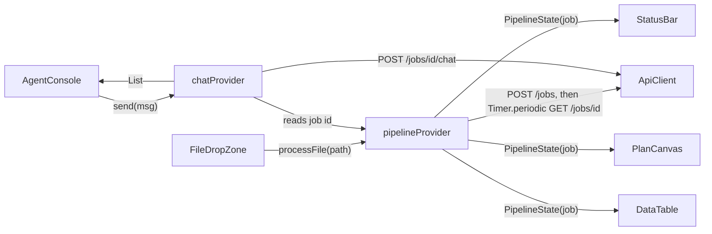

# Frontend Guide — Planner's Playground

Flutter desktop app (package `planner_playground`) implementing the
three-panel planner workstation from `frontend/FLUTTER_PLAYGROUND_SPEC.md`.
Scaffolded for **Linux, macOS, Windows, and web**.

## Panel Layout

```
┌──────────────────────────────────────────────┬────────────────────┐
│  PipelineStatusBar (always visible)          │                    │
│  ──────────────────────────────────────────  │   AgentConsole     │
│  WorkspacePanel                              │   - chat history   │
│    FileDropZone   (no file yet)              │   - macro chips    │
│    PlanCanvas     (payload available)        │   - input field    │
├──────────────────────────────────────────────┤                    │
│  DataTablePanel (metrics)                    │                    │
└──────────────────────────────────────────────┴────────────────────┘
```

## Directory Map (`frontend/lib/`)

```
lib/
├── main.dart                 ProviderScope + app entry
├── app.dart                  MaterialApp + PlannerDashboard (3-panel Row/Column)
├── core/
│   ├── config.dart           API_BASE_URL (--dart-define), poll interval
│   ├── api_client.dart       Dio wrapper: uploadFile / getJob / sendChat
│   └── theme.dart            Material 3 dark theme
├── models/
│   └── job.dart              Dart mirror of backend schemas — KEEP IN SYNC
├── state/
│   ├── pipeline_provider.dart  upload → poll → ready lifecycle (Notifier)
│   └── chat_provider.dart      chat history + agent calls (Notifier)
└── features/
    ├── workspace/workspace_panel.dart     drop zone ⇄ canvas switcher
    ├── ingestion/file_drop_zone.dart      file_picker + desktop_drop
    ├── ingestion/pipeline_status_bar.dart status line + reset
    ├── canvas/plan_canvas.dart            CustomPainter geometry renderer
    ├── data_view/data_table_panel.dart    metrics DataTable
    └── console/agent_console.dart         chat UI + macro buttons
```

## State Management (Riverpod)

Two `Notifier` providers own all app state; widgets are `ConsumerWidget`s that
`watch` them — no `setState` business logic anywhere.



- **`pipelineProvider`** — `PipelineState { job, uploading, error }`.
  `processFile()` uploads, then polls every `AppConfig.pollInterval` (1 s)
  until `ready`/`failed`; the timer is cancelled on dispose and on `reset()`.
- **`chatProvider`** — ordered `List<ChatMessage>` (`role: user|agent`).
  Refuses politely when no job is `ready` yet; guards against double-sends.

## Canvas Rendering (`plan_canvas.dart`)

`_PlanPainter` draws the raw `shapely`/`ezdxf` output — no backend-rendered
image needed:

- Scales world coordinates into the viewport using `payload.bounds`
  (uniform scale, 24 px margin) and **flips the Y axis** (CAD is Y-up,
  screen is Y-down)
- Strokes polylines/lines as `Path`s, circles via `drawCircle`
- Colors are assigned per layer from a fixed 6-color palette
- Plan annotations are drawn with `TextPainter` at their insert points

New `Geometry.kind`s from the backend degrade gracefully: anything with ≥ 2
points is stroked as a path.

## Backend Wiring

`core/config.dart`:

```bash
# local backend (default): http://localhost:8000
flutter run -d linux

# any other backend, e.g. Cloud Run:
flutter run -d linux --dart-define=API_BASE_URL=https://rail50hz-backend-xyz.a.run.app
```

The contract lives in `models/job.dart` and is a **hand-written 1:1 mirror**
of `backend/app/models/schemas.py` (wire format: snake_case JSON). When
changing the backend contract, update both — the widget/unit tests and
`flutter analyze` will catch most drift.

## Platforms

```bash
flutter run -d linux      # primary target (spec)
flutter run -d macos
flutter run -d windows
flutter run -d chrome     # web: drag-and-drop works; file paths come from bytes
```

Note for web: `FilePicker` returns bytes instead of a path there — the upload
call in `api_client.dart` needs a `MultipartFile.fromBytes` branch when web
becomes a real target (desktop-first for the POC).

## Extending

- **New panel:** create `features/<name>/`, add it to the `Row`/`Column` in
  `app.dart`, read state from an existing provider or add a new `Notifier`.
- **New quick-action macro:** append the label to `_macros` in
  `agent_console.dart` — it's sent as a plain chat message.
- **Highlight non-compliant geometry:** the report's `Finding.location`
  carries layer names/coordinates; join it against `payload.geometries` in
  `_PlanPainter` and stroke matches in the error color.

## Checks

```bash
cd frontend
flutter analyze     # zero-issue baseline
flutter test        # widget smoke test: three-panel layout renders
```
