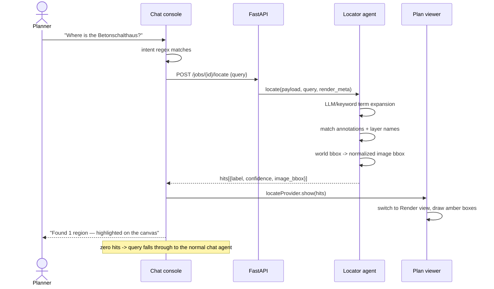

# Locator Agent — Visual Grounding of Planner Queries

**Use case:** the planner asks the chat *"Where is the Betonschalthaus?"* and
the system highlights the matching region directly on the rendered plan
canvas — bounding box + label overlay — instead of only answering in text.

Status: ✅ implemented and verified on `Kreuzungsplan.dwg` (2026-07-18).

## 1. Design

### 1.1 Roles

| Piece | Responsibility |
| :--- | :--- |
| **Chat intent router** (frontend, `chat_provider.dart`) | Detects visual-grounding queries (`where / wo ist / zeig / locate / markiere / highlight / find the …`) and routes them to the locator instead of the plain chat agent. Zero hits → falls through to normal chat, so the router can't eat questions. |
| **Locator agent** (backend, `app/agent/locator.py`) | Query → search terms → matches against the *compliance agent's data layer* (extracted annotations + layer names) → bounding boxes. |
| **Term expansion** (LLM, optional) | With `AGENT_MODE=openai`, gpt-4o-mini expands the query into German CAD synonyms/word stems (`Betonschalthaus → ["betonschalthaus", "schalthaus", …]`). Fallback: stopword-filtered keywords — the feature works without any LLM. |
| **Coordinate mapper** (backend, `renderer.py` + locator) | The renderer stores its world-coordinate window + pixel size in `render.json`; the locator converts world bboxes into normalized (0..1, y-down) image rects. |
| **Overlay** (frontend, `plan_viewer.dart`) | Draws amber boxes + labels over the render PNG, auto-switches to Render view, shows a dismissible hit-count chip. |

### 1.2 Sequence



### 1.3 Matching strategy

Two evidence sources, ranked by confidence:

1. **Annotation text** (`TextItem`s) — exact token match = 1.0, compound-word
   substring = 0.8 (`schalthaus` ⊂ `betonschalthaus`). Anchor = text insert
   point; bbox = anchor ± 2 % of the plan extent.
2. **Layer names** — same scoring × 0.9 (coarser evidence); bbox = envelope of
   all geometry on that layer. This is what answers *Betonschalthaus* on the
   real plan: no annotation says it, but layer `VG-BLO-Schalthaus` does.

Top 12 hits, sorted by confidence. Highlight form: **box** (a heatmap was
considered and rejected for the POC — with ≤12 discrete anchors there is no
density to visualize, and boxes are legible at any zoom).

## 2. API

`POST /api/v1/jobs/{job_id}/locate` · body `{"query": "..."}` · 409 before
extraction finishes, 404 for unknown jobs.

```json
{
  "query": "where is the Betonschalthaus?",
  "terms": ["betonschalthaus", "schalthaus", "..."],
  "render_size": [2600, 1940],
  "hits": [
    {
      "label": "Layer: VG-BLO-Schalthaus",
      "source": "layer",
      "confidence": 0.9,
      "anchor": [563112.4, 5711150.2],
      "world_bbox": [563100.1, 5711140.0, 563124.8, 5711160.3],
      "image_bbox": [0.407, 0.502, 0.427, 0.517]
    }
  ]
}
```

`image_bbox` is normalized to the render PNG (y-down); the frontend wraps the
image in an `AspectRatio(render_size)` so the rects land pixel-true, and the
overlay lives inside the `InteractiveViewer` child so it zooms/pans with the
plan.

## 3. Verified results (live server, Kreuzungsplan.dwg)

| Query | Terms resolved (LLM) | Hits |
| :--- | :--- | :--- |
| "where is the Betonschalthaus?" | betonschalthaus, **schalthaus**, schaltraum, … | 1 — layer `VG-BLO-Schalthaus`, bbox ≈ (0.41, 0.50)–(0.43, 0.52) — the small switch-house at plan center |
| "wo ist der Betonkabelkanal" | betonkabelkanal, kabelkanal, kanal | 8 — every "Betonkabelkanal Gr. I/II/III i.F." annotation, each pinned at its insert point |

## 4. Files

| File | Change |
| :--- | :--- |
| `backend/app/agent/locator.py` | new — term expansion, matching, coordinate mapping |
| `backend/app/extraction/renderer.py` | writes `render.json` (world window + px size) |
| `backend/app/models/schemas.py` | `LocateRequest/LocateHit/LocateResponse` |
| `backend/app/api/routes.py` | `POST /jobs/{id}/locate` |
| `frontend/lib/models/locate.dart` | Dart mirror of the locate schemas |
| `frontend/lib/state/locate_provider.dart` | current highlights (cleared on new plan) |
| `frontend/lib/state/chat_provider.dart` | intent regex + locate-first routing |
| `frontend/lib/features/canvas/plan_viewer.dart` | amber box overlay, auto-switch, hit chip |

## 5. Limitations & next steps

- **Evidence = extracted data only.** Text inside block references is still
  invisible to the locator (same INSERT/ATTRIB gap as the parser); the
  Schalthaus case works via its *layer*, not its label. Block traversal
  remains the highest-value upgrade — it will improve locate recall for free.
- Layer-envelope bboxes can be large when a layer spans the plan; per-cluster
  splitting (e.g. DBSCAN on the layer's geometry) would tighten them.
- Overlay only on the **Render** view; drawing the same hits on the Vector
  canvas is straightforward (world coords are already in the response).
- The intent regex is deliberately simple; routing via LLM function-calling
  is the clean long-term shape once more visual tools exist (measure,
  compare, zoom-to).
