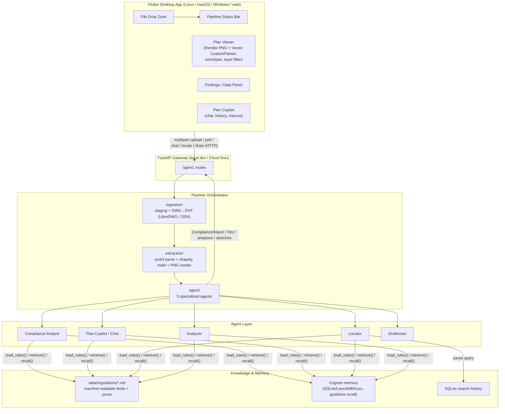
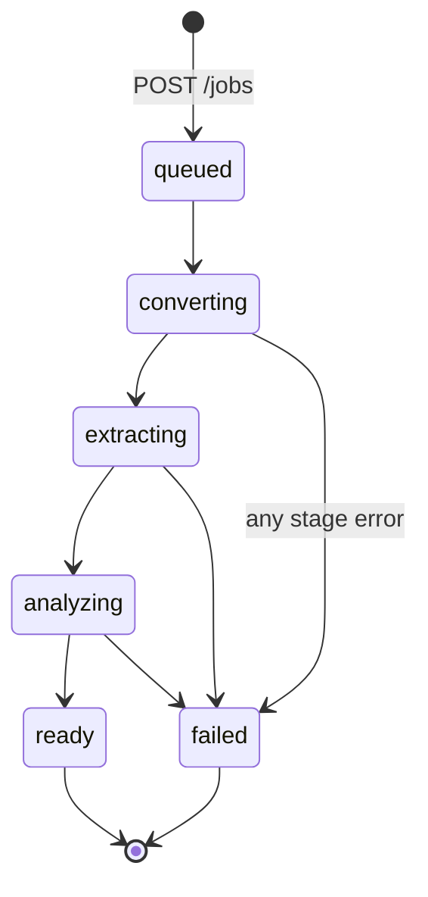
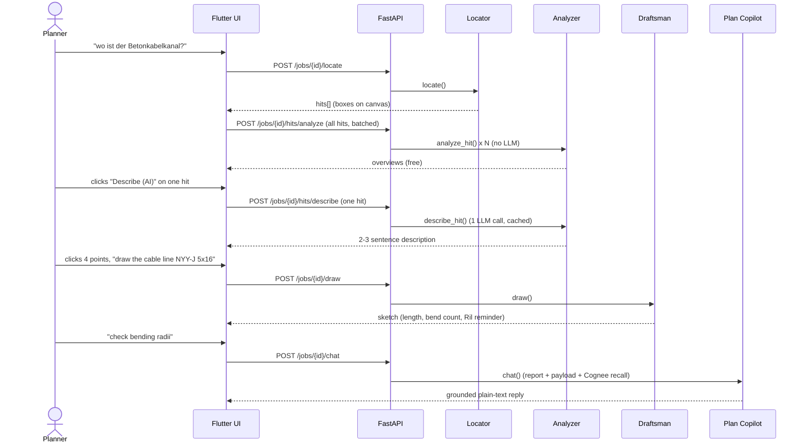

# Rail50Hz.ai — Progress Report & Product Roadmap

**Date:** 2026-07-22 · **Stage:** Hackathon POC, feature-complete for the core
loop · **Branch:** `feat/editing_with_ui_canvas`

This is the state-of-the-union for turning the hackathon POC into a real
product: what's built, how it's architected, what's proven to work against
real DB data, and what stands between here and a production system.

---

## 1. Executive Summary

Electrical planning engineers manually transcribe CAD (DWG) metadata into
compliance documentation for low-voltage connections to railway-owned 50 Hz
energy systems (DB Energie). Mistakes are two kinds: **template drift**
(citing a retired guideline like Ril 954.0107) and **physical parameter
errors** (a bending radius or pulling force outside spec) — both trigger
rejections at Federal Railway Authority (EBA) review, costing weeks.

**Rail50Hz.ai automates the first data layer of that review**: upload a DWG
plan, get it converted and structured, and have a set of AI agents read,
locate, analyze, sketch on, and answer questions about it — grounded in the
actual DB Ril / VDE ruleset, not a generic LLM guess.

The POC is **not a toy demo** — every feature listed below has been run
against a **real DB crossing plan** (`Kreuzungsplan.dwg`, 38 layers, 946
geometries, 83 German annotations), not just the synthetic sample. Five
purpose-built agents are wired end-to-end: compliance analyst, chat copilot,
locator (visual grounding), analyzer (per-finding drill-down), and draftsman
(sketch overlay). Liability for final validation always remains with the
human engineer — the system is a first-pass assistant, not a sign-off tool.

---

## 2. What's Built — Feature Inventory

| # | Feature | Status | Verified on real data? |
| :-- | :--- | :--- | :--- |
| 1 | DWG → DXF conversion (dual engine: LibreDWG open-source + ODA proprietary fallback) | ✅ | ✅ all 6 AutoCAD generations 2000–2018 |
| 2 | CAD geometry extraction (`ezdxf` + `shapely`): layers, polylines/lines/circles, text/annotations, metrics, bounds | ✅ | ✅ Kreuzungsplan: 38 layers, 946 geometries, 83 annotations |
| 3 | Server-side plan rendering (`ezdxf.addons.drawing` → PNG), incl. block symbols the entity parser can't see | ✅ | ✅ 2600×1940 px in 1.8 s |
| 4 | Async job pipeline (`queued→converting→extracting→analyzing→ready/failed`) with polling API | ✅ | ✅ |
| 5 | **Compliance agent** — structured findings (`compliant`/`non_compliant`/`warning`) against a machine-readable Ril/VDE ruleset, three backends (mock / OpenAI / Vertex Gemini) behind one interface | ✅ | ✅ |
| 6 | **Plan Copilot** (chat agent) — free-text Q&A grounded in the plan payload + compliance report + regulation excerpts; guaranteed plain-text replies | ✅ | ✅ |
| 7 | **Locator agent** — visual grounding: "where is the Betonschalthaus?" → highlighted box(es) on the render canvas, via annotation/layer term matching + coordinate mapping | ✅ | ✅ 1–8 hits per query, correct region |
| 8 | **Analysis agent** — two-tier per-finding drill-down: free deterministic overview for every locator hit, AI description only on click (token-frugal by design) | ✅ | ✅ |
| 9 | **Draftsman agent** — click points on canvas → copilot connects them into a cable-line sketch overlay with computed length + Ril 954.9101 bending-radius/pulling-force reminders | ✅ | ✅ 59.65 m / 4-point sketch |
| 10 | Zoomable/pannable canvas (0.1×–25×), Render/Vector view toggle, per-layer color classification, per-layer visibility filter (client + server-side re-render) | ✅ | ✅ |
| 11 | Cognee long-term memory: guideline/norm recall injected into chat + describe agents; seed script for dropping in more regulation files | ✅ | ✅ recalls 150 mm bending-radius rule |
| 12 | Search history (SQLite) — every locate query saved, browsable, re-runnable | ✅ | ✅ |
| 13 | Per-agent editable system prompts (`agent/prompts/*.md`), all carrying project/domain context | ✅ | — |
| 14 | UX pass: selectable/editable chat text, quick-guide walkthrough, tooltips, layer filter badges | ✅ | — |
| 15 | Desktop-first Flutter app (Linux/macOS/Windows, web-scaffolded) with Riverpod state, hand-mirrored API contract | ✅ | ✅ |
| 16 | Block-reference (`INSERT`/`ATTRIB`) content extraction | ⬜ **not started** | — highest-value gap, see §5 |
| 17 | Sketch persistence / export to DXF | ⬜ **not started** | draftsman output is session-only |
| 18 | Auth, multi-tenant job storage, cloud file storage | ⬜ **not started** | in-memory / local-disk only |

---

## 3. System Architecture

### Component responsibilities

| Component | Path | Responsibility |
| :--- | :--- | :--- |
| Flutter app | `frontend/` | Upload, visualize (render + vector), inspect findings, chat, sketch |
| API gateway | `backend/app/api/` | REST surface; job lifecycle + all agent endpoints |
| Orchestrator | `backend/app/pipeline/` | Drives convert → extract → analyze; holds the `JobStore` |
| Ingestion | `backend/app/ingestion/` | Upload staging, dual-engine DWG→DXF conversion |
| Extraction | `backend/app/extraction/` | DXF entity parsing, spatial metrics, server-side rendering |
| Agent layer | `backend/app/agent/` | 5 agents (analyst, chat, locator, analyzer, draftsman), mini-RAG |
| Memory | `backend/app/memory/` | Cognee guideline recall, SQLite search history |
| Schemas | `backend/app/models/schemas.py` | Single source of truth for the API contract |

### Job state machine

---

## 4. The Agentic System — In Detail

Five agents, each with its own scoped responsibility, editable system prompt
(`backend/app/agent/prompts/*.md`), and a **deliberate cost discipline**: only
the operations that genuinely need an LLM call make one.

| Agent | Trigger | LLM call? | What it does |
| :--- | :--- | :--- | :--- |
| **Compliance Analyst** | automatic, end of pipeline | ✅ (or mock rules) | Structured findings against the Ril/VDE ruleset: `compliant` / `non_compliant` / `warning`, with citation, expected vs. actual, suggestion |
| **Plan Copilot (chat)** | planner message | ✅ (or mock echo) | Free-text Q&A grounded in payload + report + regulation excerpts + Cognee memory; guaranteed plain-text output |
| **Locator** | "where is X?" intent | optional (term expansion only) | Query → search terms → matches against annotations/layer names → world bbox → normalized image bbox → canvas highlight boxes |
| **Analyzer** | after every locate (overview) / on click (description) | overview: no · description: ✅ | Two-tier: free deterministic per-hit overview always shown; AI description is opt-in per finding, cached after first click |
| **Draftsman** | "draw ..." intent + clicked points | ✅ (instruction parsing, keyword fallback) | Connects planner-clicked canvas points into a labeled sketch (cable line), computes real-world length, attaches the relevant Ril rule reminder |

**Why this design (and not "one big agent"):** a single real plan payload is
243 KB / ~62k tokens — sending that raw to an LLM on every interaction is
both slow and expensive. Splitting into scoped agents means:
- The compliance analyst gets a **digested** payload (per-layer aggregated
  metrics + all annotations), not the raw JSON.
- The locator can answer purely from **local geometry matching** — no LLM
  required unless term expansion is wanted.
- The analyzer's overview tier is **pure local math** — a 12-hit locate
  produces 12 overviews for free; describing all 12 would be 12 wasted calls,
  so description is strictly click-triggered.
- Cognee memory recall is **selective** (≤2 snippets, ≤400 chars) — injected
  context, not a full RAG dump.

---

## 5. CAD Engine Decision — Why Not Open CASCADE (OCCT)

A partner-facing question worth stating plainly: **we evaluated Open CASCADE
Technology** (the C++ B-Rep kernel behind FreeCAD/CadQuery) as a possible CAD
engine and **rejected it for the current 2D pipeline**, keeping it on the
roadmap for a future 3D feature.

**We didn't take this on faith — we downloaded and ran the candidates:**

| Engine | Tested how | Verdict |
| :--- | :--- | :--- |
| **LibreDWG** (`dwg2dxf` + full toolset) | Built from source, run against `Kreuzungsplan.dwg` | ✅ **adopted** — DWG→DXF conversion, 31 ms, all 6 AutoCAD generations. Bonus tools verified too: `dwggrep` (full-text search inside binary DWG, no conversion needed), `dwglayers`, `dwgread` |
| **ezdxf `drawing` add-on** | Installed matplotlib, rendered the real plan | ✅ **adopted** — 1.8 s/plan, PNG+SVG, and critically **includes block symbols** the entity parser doesn't traverse yet |
| **Open CASCADE (`cadquery-ocp` wheels)** | Installed the 68 MB wheel, built a parametric solid, round-tripped STEP | ⚠️ **works, but wrong tool** — the open-source OCCT core reads/writes **STEP and IGES only**; DWG/DXF import is a **commercial add-on** Open Cascade sells separately. Even with a converted file, OCCT models geometry (B-Rep solids), not drawing semantics (layers, block references, annotations) — exactly the signal our compliance checks need |
| FreeCAD, QCAD CE, LibreCAD, OpenSCAD, KiCad | Surveyed, not installed | Each either duplicates what `ezdxf` already does, is GUI-first, or is the wrong domain entirely |

**Current engine of record:** `LibreDWG (dwg2dxf) → ezdxf → shapely` for
conversion/extraction, `ezdxf.addons.drawing` for rendering. This stack reads
layers, text, blocks and geometry — the actual compliance signal — in
milliseconds, with zero licensing friction (GPL/MIT).

**Where OCCT re-enters the roadmap:** if the product later needs **3D**
(importing STEP models of switchgear cabinets, computing clearance distances
to live parts per VDE, or extruding 2D plans into a 3D scene for a Flutter 3D
viewer), OCCT is genuinely the right kernel — full write-up in
[CAD_ENGINE_EVALUATION.md](CAD_ENGINE_EVALUATION.md).

---

## 6. Tech Stack

| Layer | Choice | Notes |
| :--- | :--- | :--- |
| Backend | Python 3.12, FastAPI | async job pipeline, background tasks |
| CAD extraction | `ezdxf`, `shapely` | DXF entities → typed geometry + spatial math |
| DWG conversion | LibreDWG (`dwg2dxf`), ODA File Converter (optional) | dual-engine, open-source first |
| Rendering | `ezdxf.addons.drawing` (matplotlib backend) | server-side PNG incl. blocks |
| AI agents | OpenAI (`gpt-4o-mini`) / Vertex AI (Gemini) / mock rules | swappable behind one `AgentClient` interface |
| Long-term memory | Cognee 1.4.0 (local SQLite + LanceDB + Kuzu, or Cognee Cloud tenant reachable) | selective recall, guideline/norm corpus |
| History | SQLite | locator search history |
| Frontend | Flutter (Riverpod, Dio) | desktop-first (Linux/macOS/Windows), web-scaffolded |
| Contract | Hand-mirrored Pydantic ⇄ Dart | no codegen yet (see gaps) |
| Deploy target | Docker → Cloud Run (Cloud Build config present) | DWG engines not yet in the container image |

---

## 7. What's Missing / Known Gaps

Ranked by product impact, not by how they were discovered:

### 7.1 Highest priority — data completeness
- **Block-reference content is invisible.** `INSERT`/`ATTRIB` entities are
  not traversed by `dxf_parser.py`. On real DB plans, a meaningful share of
  annotation text lives inside blocks (symbols, title blocks, tables) —
  this caps recall for extraction, locator, and analyzer alike. Verified
  gap: on the original 130-file DWG census, several files parsed to **0 text
  entities** because of exactly this. This is the single highest-leverage
  next engineering task.
- Legacy `POLYLINE` (pre-LWPOLYLINE) and `ARC` entities aren't parsed —
  one census file produced 0 geometries because of this.
- `HATCH`, `SPLINE`, `SOLID`, `DIMENSION` entities render (via the PNG path)
  but carry no extracted semantics yet.

### 7.2 Product-grade infrastructure (currently hackathon-grade)
- **Job storage is in-memory** (`JobStore` — a dict + lock). A restart or a
  second Cloud Run instance loses all jobs. Needs Firestore/Redis/Postgres.
- **File storage is local disk** (`workdir/`). Needs a GCS/S3 bucket.
- **No authentication, no multi-tenancy, no rate limiting.** Anyone who can
  reach the URL can upload and query. CORS is `*`.
- **DWG engines aren't in the Cloud Run image yet** — deployed POC currently
  accepts `.dxf` only; compiling LibreDWG into the Docker image is
  straightforward (multi-stage build) but not done.
- **Draftsman sketches are session-only** — not persisted server-side, not
  exported back into the DXF/DWG. No way to hand a finished sketch to a CAD
  tool yet.
- **API contract is hand-mirrored** (Pydantic ⇄ Dart) rather than generated —
  fine at this size, will drift as the surface grows. OpenAPI codegen is the
  natural fix.

### 7.3 UX polish / interaction completeness
- Canvas → panel selection doesn't work yet (only panel → canvas); clicking
  a highlighted box doesn't select its row.
- No "zoom to finding" on selection.
- Draftsman has no snap-to-existing-geometry — clicks are freehand.
- Region membership in the analyzer is point-in-bbox, so a line crossing a
  region with both endpoints outside is missed.
- Cognee recall adds ~15–25 s to a memory-backed chat turn (LLM-routed) —
  needs snippet caching.

### 7.4 Compliance depth
- The current ruleset covers exactly two physical parameters (bending
  radius, pulling force) and citation drift. A real product needs the full
  DB Ril 954.9101 / VDE 0100-520 rule surface, plus rules for adjacent
  guidelines (grounding, clearances, labeling).
- Findings are not yet exportable into the actual "Erläuterungsbericht"
  document format planners submit to EBA — currently a JSON report + chat
  summary only.

---

## 8. Roadmap to a Real Product

| Phase | Goal | Key work |
| :--- | :--- | :--- |
| **Phase 1 — Data completeness** (next) | Stop losing information on real plans | Block/`INSERT` traversal in `dxf_parser.py`; legacy `POLYLINE`/`ARC` support; re-run against the full DWG census to measure recall improvement |
| **Phase 2 — Productionize infra** | Survive a restart, support >1 user | Firestore/Redis job store; GCS file storage; auth (Firebase/IAP) in front of Cloud Run; DWG engine baked into the Docker image; OpenAPI-generated Dart client |
| **Phase 3 — Compliance depth** | Cover the real regulatory surface | Expand the machine-readable ruleset with DB Ril/VDE subject-matter input; structured export to the Erläuterungsbericht format; audit trail per finding |
| **Phase 4 — Sketch → CAD round-trip** | Draftsman becomes an editing tool, not just an overlay | Persist sketches per job; write them back into the DXF as a real layer via `ezdxf`; snap-to-geometry |
| **Phase 5 — Interaction completeness** | Close the investigation loop | Canvas→panel selection, zoom-to-finding, segment-level region membership, Cognee recall caching |
| **Phase 6 — Scale & 3D (optional)** | Broader engineering workflows | Multi-instance Cloud Run with shared state; OCCT-based 3D features (clearance analysis, cabinet models) if the product direction calls for it |

**What this POC already de-risks for a real product:** the hardest technical
question — *can AI agents reliably read and reason over real, messy DB CAD
files, not just clean synthetic ones* — has been tested against actual
production data (`Kreuzungsplan.dwg`) and works for the data that is
currently extracted. Phase 1 (block traversal) is what closes the remaining
gap between "works on the data we extract" and "works on everything in the
file."

---

## 9. Reference Documentation

| Doc | Contents |
| :--- | :--- |
| [ARCHITECTURE.md](ARCHITECTURE.md) | System design, sequence diagrams, design decisions |
| [API.md](API.md) | Full REST reference + data contract |
| [BACKEND.md](BACKEND.md) | Backend module guide |
| [FRONTEND.md](FRONTEND.md) | Flutter app guide |
| [DEPLOYMENT.md](DEPLOYMENT.md) | Local setup, DWG engines, Docker, Cloud Run |
| [DATASET_INGESTION.md](DATASET_INGESTION.md) | DWG dataset findings, converter build story |
| [CAD_ENGINE_EVALUATION.md](CAD_ENGINE_EVALUATION.md) | Full OCCT feasibility study |
| [LOCATOR_AGENT.md](LOCATOR_AGENT.md) | Locator agent design + verified results |
| [ANALYSIS_AGENT.md](ANALYSIS_AGENT.md) | Analysis agent design + verified results |
| [UX_AND_MEMORY.md](UX_AND_MEMORY.md) | Search history, Cognee memory, UX pass |
| [DRAFTSMAN_AGENT.md](DRAFTSMAN_AGENT.md) | Draftsman agent design + verified results |
