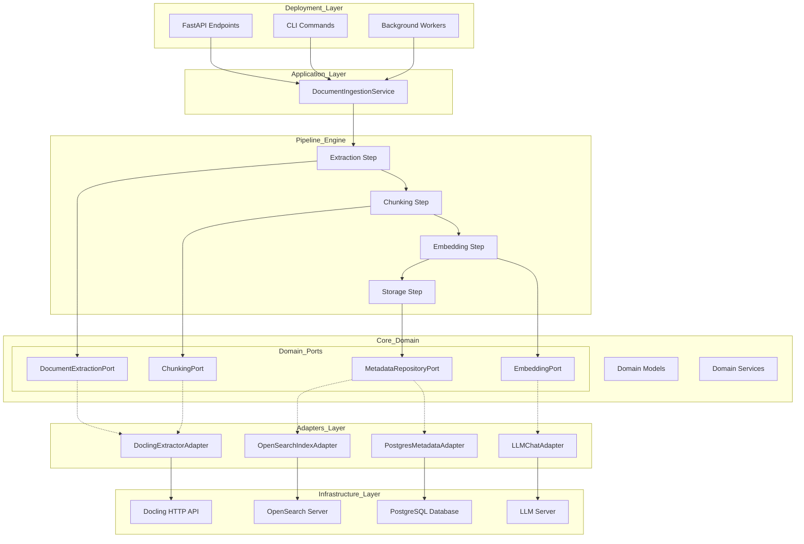

# System Design

Plain-Markdown transcription of `docs/system_design/System Design.pdf` (10 pages), so the
target pattern is greppable/readable without re-extracting the PDF every session. This is the
source design; `docs/architecture/README.md` is this repo's concrete application of it and
`docs/architecture/MIGRATION_MAP.md` tracks the migration itself.

## Table of contents

1. Domain-Driven Design (DDD)
2. Hexagonal Architecture / Ports & Adapters
3. Inversion of Control (IoC)
4. Pipes & Filters (Pipeline Design)

> "Focus your code around the *business logic*, not the framework."

## 1. Domain-Driven Design (DDD)

In the architecture diagram, the **Core Domain** is the center:

```
Core-Domain
├── Domain Models
├── Domain Services
└── Ports (abstractions)
```

This lives in `backend/domain/`.

### What is the idea?

DDD says:
- The **important part** of your app is the *business rules*, not APIs, not databases.
- So you put your "real logic" inside domain models + services.
- Everything else is just a *detail*.

### Example from your system

Domain says:

> "To extract text, I need something that behaves like `DocumentExtractionPort`."

It doesn't know:
- ❌ how Docling works
- ❌ HTTP requests
- ❌ file storage
- ❌ chunk sizes

The domain only knows **what** must be done, not **how**.

### Benefits

- **Very reusable** — the same domain can work with Docling, Tika, ML, etc.
- **Easy to modify** — replace Docling without touching business logic.
- **Keeps code clean** — business logic stays separated from frameworks.

### Downsides

- Harder to understand at first for beginners.
- Requires more files → seems more complex.
- Needs discipline: if developers break boundaries, the architecture collapses.

## 2. Hexagonal Architecture / Ports & Adapters

> "Business logic never depends on technical implementation."

This is where Inversion of Control (IoC) comes in.

### 2.1 Ports & Adapters

📍 **Where it appears**

The diagram clearly separates:

```
Ports (core-domain)
Adapters (infrastructure)
```

Examples:
- **Port**: `DocumentExtractionPort` (interface)
- **Adapter**: `DoclingExtractorAdapter` (actual Docling HTTP calls)

### What does it mean?

- Ports = interfaces defined in the domain
- Adapters = classes that implement the port using real technology

Domain → defines *what* it needs
Adapter → provides *how* it's done

### Example

Domain Port:

```python
class DocumentExtractionPort(Protocol):
    async def extract(self, file_bytes, filename): ...
```

Adapter:

```python
class DoclingExtractorAdapter(DocumentExtractionPort):
    async def extract(...):
        return docling_api_request(...)
```

If tomorrow you replace Docling with Tika, only the adapter changes — domain stays untouched.

### Benefits

- **Pluggable architecture** — swap Docling for another extractor without changing your pipelines.
- **Perfect for microservices** — if tomorrow you move extraction to another service, domain doesn't care.
- **Testability** — mock the port → test the domain without running Docling or a database.
- **Loose coupling** — domain doesn't depend on slow APIs / fragile infrastructure.

### Downsides

- More files (lots of abstractions).
- More complex for beginners ("why 3 files for one feature??").

## 3. Inversion of Control (IoC)

> "Low-level modules plug into high-level modules, not the other way around."

Normally code is written like:

```python
Service -> calls -> DoclingClient()
```

But with IoC:

```python
Domain defines "I need a DocumentExtractor"
Framework injects the Docling adapter into the domain
```

📍 **Where IoC appears in your system**

```python
Core Domain  <-- depends on Ports
Adapters     <-- implement Ports
```

Domain does **NOT import adapters**.
Adapters import the **domain port**.
This flips dependencies upside down (inverted!).

### Benefit Example

In the ingestion pipeline:
- Pipeline calls `DocumentExtractionPort`
- At startup, IoC injects:
  - `DoclingExtractorAdapter` in production
  - `FakeExtractor` in tests

Meaning your domain is never tied to concrete services.

### Benefits

- **Super testable** — test ingestion without running a Docling server.
- **Maintainable** — replace parts without touching domain logic.
- **Follows SOLID principles** — especially the "Dependency Inversion Principle".

### Downsides

- Hard to learn
- Requires dependency injection patterns
- More layers = more complexity for small teams

## 4. Pipes & Filters (Pipeline Design)

### Where it appears

In your backend:

```
Architecture Framework: Pipes & Filters
```

Every step is a filter:

```
Extract -> Chunk -> Embed -> Store -> Index
```

The pipeline itself is a pipe.

### What does it mean?

Each step:
- does **ONE job**
- has a **simple input -> output**
- doesn't know other steps

Like Unix pipes:

```
cat document | extract | chunk | embed | store
```

### Example from your system

Extraction Step:

```python
async def __call__(context):
    context.chunks = extractor.extract(context.file_bytes)
```

Chunking Step:

```python
async def __call__(context):
    context.final_chunks = chunker.chunk(context.chunks)
```

Each step is replaceable.

### Benefits

- **Flexible workflows** — want OCR before extraction? Add a step. Want translation? Add a step.
- **Extremely modular** — each step is testable in isolation.
- **Parallelization possible**

### Downsides

- A lot of context-passing
- Harder debugging across many small steps
- Pipeline becomes complex if misused

## Summary table

| Paradigm | Meaning | Where Used | Why It's Good |
|---|---|---|---|
| DDD | Domain rules in the center | `/domain` | Clean, stable, business-focused |
| Ports & Adapters | Abstractions vs implementations | `/domain/ports`, `/adapters` | Replace Docling easily |
| IoC | Domain depends on ports, adapters depend on domain | Everywhere | Decoupled, testable system |
| Pipes & Filters | Modular pipeline steps | `/pipelines/*` | Flexible ingestion / RAG |
| Application Services | Orchestrate use cases | `/application/services` | Clean separation between logic & delivery |
| Deployment Layer | FastAPI, CLI | `/api/` | Interface to the real world |

## Architecture Diagram

```
DEPLOYMENT LAYER (API / CLI / Workers)
------------------------------------------
- FastAPI Endpoints
- CLI Commands
- Background Workers
        |
        v
APPLICATION SERVICES (Use Cases)
------------------------------------------
- Orchestrates workflows ("Ingest Document")
- Builds & runs Pipelines
- Calls Domain ports (never adapters!)
        |
        v
PIPELINE ENGINE (Pipes & Filters Framework)
------------------------------------------
- Pipeline = sequence of steps
- Each Step = 1 isolated responsibility
- Examples:
    - ExtractionStep
    - ChunkingStep
    - EmbeddingStep
    - StorageStep
(Pipeline steps call Domain Ports)
        |
        v
CORE DOMAIN (Business Logic)
------------------------------------------
- Domain Models (Document, Chunk, Metadata)
- Domain Services (Rules, policies)
- Ports = Interfaces defined by domain
    - DocumentExtractionPort
    - ChunkingPort
    - EmbeddingPort
    - MetadataRepositoryPort
Inversion of Control (IoC):
Domain depends ONLY on Ports (abstract),
not on real technology.
        |
        v
ADAPTERS (Infrastructure Implementations)
------------------------------------------
- Implement ports using real tech:
    - DoclingExtractorAdapter
    - OpensearchIndexAdapter
    - PostgresMetadataAdapter
    - LocalFileStorageAdapter
    - LLMChatAdapter
- These talk to:
    - External APIs
    - Databases
    - File systems
    - LLM models
        |
        v
INFRASTRUCTURE (External Services)
------------------------------------------
- Docling HTTP API
- Opensearch Server
- PostgreSQL
- Vector Store
- LLM Server / vLLM
```


